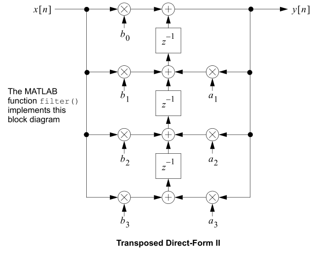

# IIR-FILTER
##### Final Project of FPGA course, Dr. Hosseini Nejad, K.N.T.U.
This projects includes *VHDL* modules and test bench for a 10 level __IIR Filter__.
> The **i**nfinite **i**mpulse **r**esponse __(IIR) filter__ is a recursive filter in that the output from the filter is computed by using the current and previous inputs and previous outputs. Because the filter uses previous values of the output, there is feedback of the output in the filter structure.

The following block diagram corresponds to the logic of the main VHDL module:

We considered two arrays for a and b coefficients and initialized them with the coefficients of a low pass filter (using MATLAB). Then accumulators were defined to store the results. Needed DFF and Multiplier modules are defined as well.

At last inputs are readed from [**input**](input.txt) and results will be provided in [**output**](output.txt).
